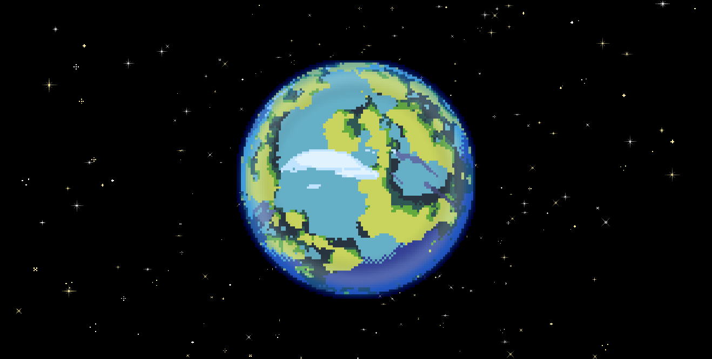
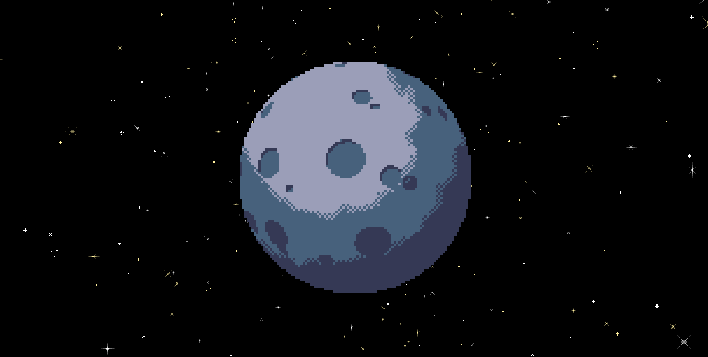
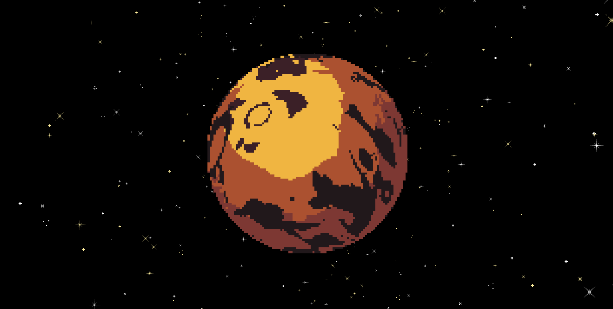
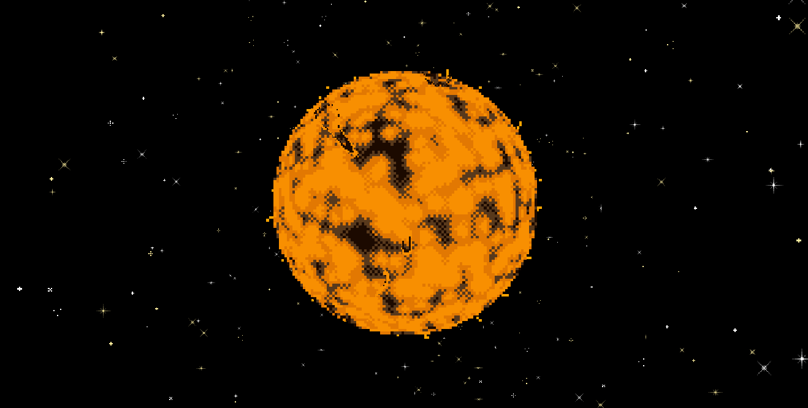
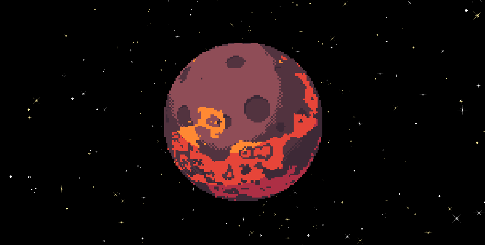
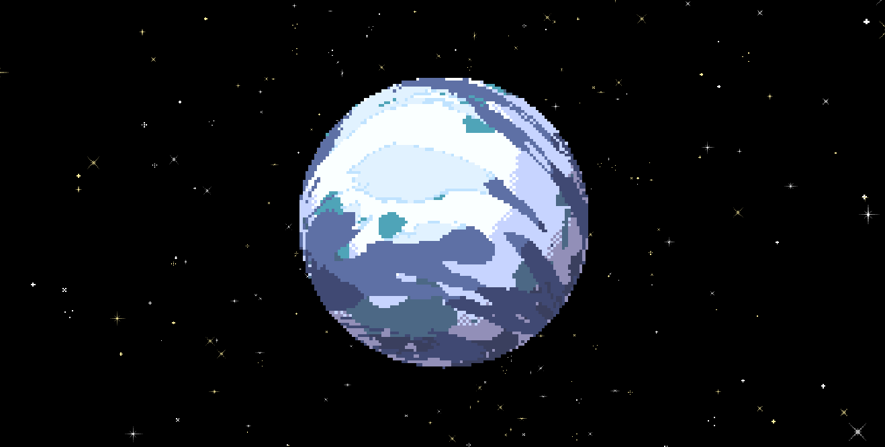
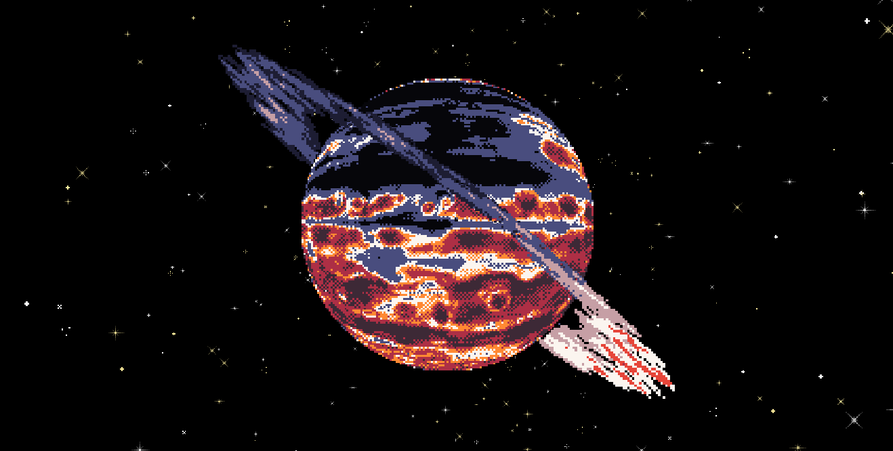
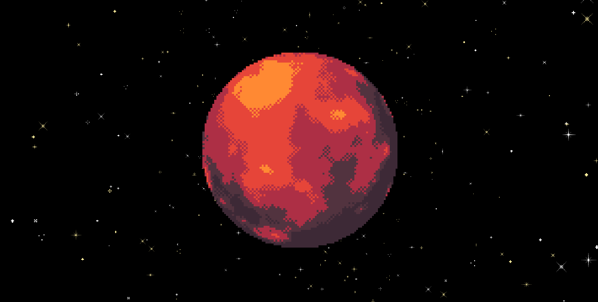
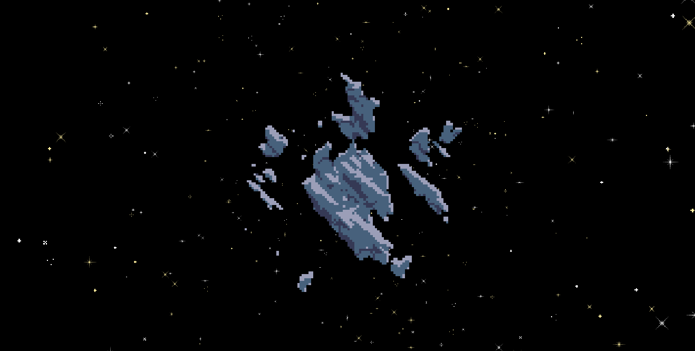

# PixelPlanetsPlus

***A procedural pixel-art orrery: adorable, chunky, dithered lil worlds that spin forever, right in your browser.***

<em>Check it out at <a href="https://pixelplanetsplus.app/">the cute lil site!</a></em>

---

Well met, fellow tiny world enjoyer! ***PixelPlanetsPlus*** is a loving, from-the-studs TS modernization of the much-beloved [Pixel Planet Generator](https://deep-fold.itch.io/pixel-planet-generator) by [Deep-Fold](https://github.com/Deep-Fold), by way of [Timur310's JavaScript/Three.js port](https://github.com/Timur310/PixelPlanets). Years after the original released, people still show up weekly asking to use these planets in their games, jams, & art. *The people thirst for cute pixel planets!* This fork intends to slake that thirst, permanently, for free.

Here's da plan: You land on a fully procedural solar system, planets tumbling & bumbling around their star on lazy elliptical orbits. Click any planet to zoom in, fiddle with every knob it has, and take it home with you in whatever format you please. Every system and every planet has a seed, every seed is a shareable link, and every link reproduces your creation pixel-for-pixel until the heat death of the universe (and/or GitHub).

🌎🧡🪐

## The Pitch

- **Kind of a Toy:** No accounts, no config wall, no fancy tutorial, just cool planets and good vibes. You arrive, a solar system is already spinning, and you just start poking it. The goal is to be the kind of thing you lose a happy half hour to and send to your pals on Discord.
- **Also a Tool:** Those weekly itch.io commenters want pixel planets *for their projects*, and they're getting the works! Exports for PNG, GIF, spritesheet, WebM, animated WebP, a JSON recipe of every parameter, QR, and a CLI bakery for pipeline nerds. MIT licensed, no strings, no BS (just TS).
- **The Same Beloved Look:** Deep-Fold's shaders are being ported faithfully, dither for dither. The fake-sphere trick, the chunky terminator checkerboard, the palette ramps will all preserved, just rebuilt on a modern engine. Also probably gonna make a lot more. Like... oodles. Just you wait.
- **Space Gets Prettier:** The port has always contained Deep-Fold's [PixelSpace](https://github.com/Deep-Fold/PixelSpace) starfield & nebula background generator, dormant in the void. I'm zesting that sucker up something fierce, and keeping Timur310's excellent atmospheric shell!
- **Some Showstoppers:** At first, just a lovely [pulsar](https://en.wikipedia.org/wiki/Pulsar). Sweeping magnetic lighthouse beams, strobing pixel heart, weird electrical donut vibes. The ancestors never had one. Fear not, for I shall provide.

## Before & After

**BEFORE:**

    </img>
    </img>
    </img>
    </img>
    </img>
    </img>
    </img>
    </img>
    </img>

**AFTER:** (sorry gimme a minute I just started lol)

## Current Status

Full rewrite in progress! The actual state of things right meow: **The new version is being built RIGHT NOW AT THE VERY MOMENT YOU READ THIS,** starting with a single planet ported end-to-end to prove the whole pipeline will do the thing before more happens. Workin' on it, honest!

## Flight Plan

No dates or deadlines, only destinations!

- All planet types ported to [TSL](https://github.com/mrdoob/three.js/wiki/Three.js-Shading-Language) on WebGPU with auto WebGL2 fallback, pixel-faithful to the OGs
- Seeded, deterministic *everything* coz shareable links are the whole point! Might do QR codes too!
- The solar system view with planets on Keplerian-ish orbits around a nice star :')
- The PixelSpace BG, galaxy, and black hole switched on, plus the upcoming pulsar!
- The full export suite, including a modernized headless render path for big nerds
- A custom interface that's actually fun to fiddle with (thank you for your service, `dat.gui`)

## Under the Crust

- **Engine:** My precious darling [Three.js](https://threejs.org/) WebGPU renderer with shaders written in TSL makes it go vroom, falls back to WebGL2 automatically
- **Site:** Vite + Tailwind, vanilla TypeScript, static hosting on GitHub Pages (the usual no backend, no trackers, no bullshit)
- **Determinism:** One seed drives every random decision, so identical seeds render identical worlds on any machine that cares to display them
- **The Space Magic:** *There are no spheres.* Each planet is a stack of flat quads whose fragment shaders quantize, spherify, noise, and dither themselves into looking like tiny rotating worlds. It's an adorable, performant lie and it's staying.

## Got Feedback?

Thoughts, wishes, bugs, or cursed seeds to report? Open an [Issue](../../issues), please! Feedback is welcome! If this project delights you and you're feeling generous, I gratefully accept fiscally responsible tips at my [Ko-fi](https://ko-fi.com/xyagain).

## On the Shoulders of Stellar Giants

This project exists because 2 people did great work before me and I appreciate it **so** much:

- **[Deep-Fold](https://github.com/Deep-Fold)** created the algorithms and the original Godot implementations of both the [Pixel Planet Generator](https://github.com/Deep-Fold/PixelPlanets) and the [PixelSpace background generator](https://github.com/Deep-Fold/PixelSpace), then released them for anyone to use. An absolute legend. Go buy something on [their itch.io page](https://deep-fold.itch.io/).
- **[Timur310](https://github.com/Timur310)** ported the whole thing to JavaScript and Three.js in [PixelPlanets](https://github.com/Timur310/PixelPlanets), which is the repo this one is forked from and the foundation every current file stands on.

## Shameless Self Promotion

If tiny pixel planets are your thing, gigantic realistic nebulae might be too: check out ***[Cosmorph](https://cosmorph.app/)***, my procedural deep-space wallpaper engine WIP! Theoretically the same universe, *wildly* different zoom level.

And if you'd rather *play in* space than look at it, ***[Mommyship](https://mommyship.mom/)*** is my Mothership RPG homebrew with a fully explorable 3D galaxy map in the browser. I got sick of not having a galactic map so I made one. It's fun!

## The Finest of Print

MIT [LICENSE](LICENSE.md)! Obviously! Use these little worlds however you want. Credit is appreciated but not required, which is exactly the deal Deep-Fold offers.
